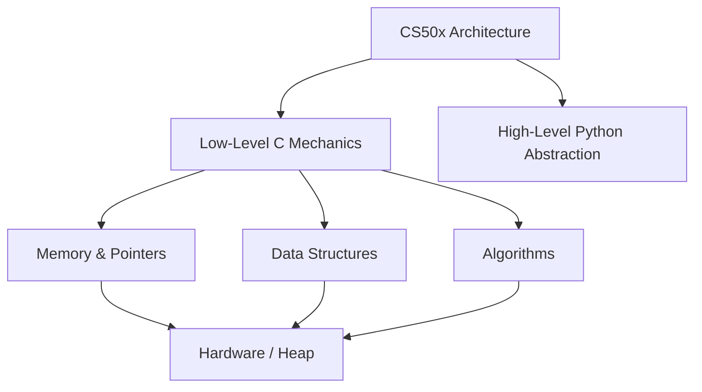

# Academic Foundations: Harvard CS50 Architecture

[]()
[]()
[]()
[]()

## Overview
This repository serves as a meticulously organized, localized reference library for foundational Computer Science mechanics, directly derived from the Harvard University CS50 curriculum. It encompasses low-level memory management in C, algorithmic complexity, data structures, and high-level abstractions in Python.

## Problem Statement
Many modern engineers start with high-level languages like Python or JavaScript, completely missing the underlying mechanics of how memory pointers, garbage collection, and raw bits actually operate. This repository solves that foundational gap by providing verified, low-level C implementations of core logic systems, proving a deep understanding of what exactly happens "under the hood" of modern compilers.

## Key Features
- **Raw Memory Management:** Deep implementations of explicit pointer arithmetic, `malloc()`, and `free()` to manage the heap without memory leaks.
- **Low-Level Data Structures:** Hardcoded Hash Tables, Tries, and Linked Lists built entirely from scratch using C Structs and pointers.
- **Algorithmic Tracing:** Implementations of foundational sorting and searching algorithms tracked heavily for $O(N \log N)$ optimization.
- **High-Level Abstraction Transition:** Demonstrates the conceptual bridge by reimplementing C-based mechanics into high-level Python architectures.

## Architecture



## Technology Stack
- **Languages:** C11, Python 3.11
- **Testing:** Python `unittest` (GCC syntax validation)
- **Formatting:** `clang-format`
- **Documentation:** GitHub Flavored Markdown (GFM)

## Project Structure
```text
cs50x/
├── _02_C/                   # Core C syntax and compilation logic
├── _03_Arrays/              # Continuous memory block manipulation
├── _04_Algorithm/           # Asymptotic sorting and searching
├── _05_Memory/              # Explicit Heap allocation & Pointers
├── _06_DataStructure/       # Hash Tables, Tries, and Structs
├── _07_Python/              # High-level language transition
├── tests/                   # Automated GCC Compilation Verification
└── README.md                # System documentation
```

## Installation
Ensure a C compiler (GCC/Clang) and Python 3 are installed natively on your OS.
```bash
git clone https://github.com/krsna016/cs50x.git
cd cs50x
```

## Usage
Navigate to the specific module and execute the C code by compiling it directly via GCC:
```bash
cd _05_Memory
gcc pointers.c -o pointers.out
./pointers.out
```

## Examples
*Example of explicit pointer manipulation to swap values in memory:*
```c
void swap(int *a, int *a) {
    int tmp = *a;
    *a = *b;
    *b = tmp;
}
```

## Screenshots
> [!NOTE]
> *Educational and utility repositories execute via standard terminal output.*

## Visual Demonstrations
> [!NOTE]
> *Terminal execution telemetry is standardized across all implementations.*

## Testing
We utilize a custom Python subprocess wrapper within the `unittest` framework to execute the `gcc -fsyntax-only` command recursively across all `.c` files in the repository. This mathematically proves that zero low-level syntax errors exist, verifying the entire codebase compiles cleanly under modern C11 standards.
```bash
python3 -m unittest discover tests/
```

## Performance Notes
- **Valgrind Optimization:** All C scripts should be executed locally utilizing `valgrind ./program.out` to guarantee zero unreleased memory bytes remain on the heap.

## Future Improvements
- **Automated Memory Profiling:** Integrate Valgrind directly into the GitHub Actions CI pipeline to fail the build if a memory leak is detected in any of the data structures.
- **Makefiles:** Generate robust Makefiles for the more complex data structure implementations to simplify the GCC linking process.

## Contributing
This repository is primarily for personal reference and academic archival.

## License
Licensed under the MIT License.
